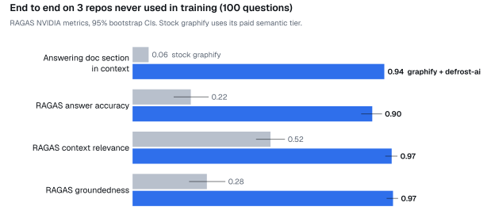
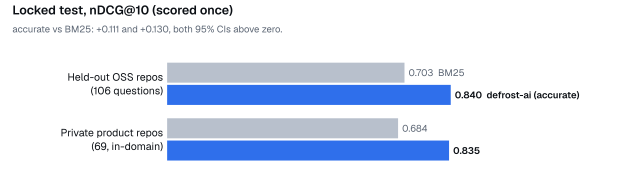

<p align="center">
  
</p>

<h1 align="center">defrost-ai</h1>

<p align="center">
  <b>Docs your AI actually reads.</b><br>
  Local, code-aware memory for Claude Code and any MCP client. One install, one question, cited answers.
</p>

<p align="center">
  <sub><b>What it is:</b> a local hybrid retrieval (RAG) index over a repository's documentation and source code,
  served to Claude Code and other MCP clients. Docs (<code>.md</code> <code>.mdx</code> <code>.rst</code>
  <code>.adoc</code>) are split into heading sections and ranked by SQLite FTS5 BM25 and Defrost-Ret-B dense vectors,
  fused by reciprocal-rank fusion. When the two disagree on the top hit, Defrost-Rerank, a cross-encoder, reorders
  the top 40. Both models are LoRA adapters on Qwen2.5-0.5B and run on your machine. Each section is linked to the
  code symbols and config files it names, using graphify's tree-sitter AST graph, so every hit returns
  <code>path:Lstart-end</code> plus the code to check it against. Git hooks re-embed only the changed sections
  after each commit or merge to main. Next to the index, <code>defrost-memory/</code> is a separate git repo in the
  project that holds session handoff notes and your doc/code conflict decisions: one commit per write, and a
  pre-commit hook enforces the layout (frontmatter, <code>MEMORY.md</code> indexes, depth and size limits).
  Interfaces: MCP (stdio), CLI, HTTP, Python.</sub>
</p>

<p align="center">
  <a href="https://github.com/Signaturi4/defrost-ai/actions/workflows/ci.yml"></a>
  <a href="https://github.com/Signaturi4/defrost-ai/releases"></a>
  <a href="#license"></a>
  
  
</p>

<p align="center">
  <a href="#quick-start">Quick start</a> ·
  <a href="#search-modes">Search modes</a> ·
  <a href="#use-with-claude-mcp-server--slash-commands">Claude</a> ·
  <a href="#how-it-works">How it works</a> ·
  <a href="#results">Results</a> ·
  <a href="#weights">Weights</a> ·
  <a href="docs/ARCHITECTURE.md">Architecture</a>
</p>

<br>

Ask a question in plain words and get back the doc sections that answer it, quoted with file and line numbers,
together with the code each section names. Agents use it through MCP or the CLI. Nothing leaves your machine and
there is no per-query API cost.

```sh
$ defrost search "how do I bind values to a structlog logger so they show up in every message?"
3 sections (accurate: reranked, the retrievers disagreed)

[1] e2e:structlog/docs/processors.md:L39-90  processors.md > Processors > Chains > Examples
### Examples If you set up your logger like: structlog.configure(processors=[f1, f2, f3])
log = structlog.get_logger().bind(x=42) and call log.info("some_event", y=23), it results in …
```

| | |
|---|---|
| **Finds the answer, not the keyword** | The answering doc section is in context for **94%** of questions, against 6% for stock graphify ([E2E](docs/E2E_GRAPHIFY.md)) |
| **Free and private** | Builds and searches on your laptop: no API calls, no tokens, no data leaving the machine |
| **Stays fresh by itself** | Refreshes on merge to main or on a schedule, and re-embeds only what changed |

> [!NOTE]
> Coming from `kev-memory` or defrost-ai 1.1? Old commands, MCP tool names, `KEV_MEMORY_*` variables and installed
> hooks keep working; they are just no longer listed. Run `defrost setup` again to switch a repository to the new hooks.
> One change in meaning: the mode 1.1 called `fast` (rerank on disagreement) is now `accurate`, the default; `fast`
> now means no reranker.

## Quick start

One command installs the CLI, downloads the weights and registers the Claude Code integration for all projects:

```sh
curl -fsSL https://raw.githubusercontent.com/Signaturi4/defrost-ai/main/install.sh | sh
```

It needs [uv](https://docs.astral.sh/uv/). It installs `defrost-ai` (the `defrost` command) as a uv tool (Python 3.12),
fetches the adapters (about 140 MB, checked by sha256) to `~/.cache/defrost-ai`, and registers the MCP server and
slash commands with Claude Code. It installs the release named in the script (a pinned tag, not the moving `main`); set
`DEFROST_VERSION=x.y.z` for another release or `DEFROST_REF=main` for the development branch. `defrost --version`
shows the installed code and weights versions.

### Set up the memory in a new repository

Once per machine: the install line above. Then, once per repository:

1. **Make it a git repository** if it is not one yet (`git init`): the refreshes after commits and merges use git
   hooks.
2. **See the recommended doc trust** (optional; setup asks anyway):

   ```sh
   cd /path/to/repo
   defrost setup . --suggest-trust     # prints the suggestion, the reason and any stored level; changes nothing
   ```
3. **Set it up**, in Claude Code or in a terminal:
   - In Claude Code: `claude`, then type `/defrost-setup`. It asks the three questions below and builds the memory.
   - In a terminal:

     ```sh
     defrost setup                                           # asks the 3 questions; Enter takes the recommended one
     defrost setup --yes --profile standard --doc-trust low  # no questions (code-heavy repository)
     defrost setup --yes --profile standard --doc-trust high # no questions (docs repository)
     ```
     `--yes` needs `--doc-trust` for a new repository. Add `--claude` to also write the MCP server and slash
     commands into this project's own config.
4. **Check it**: `defrost status` lists the repository with its sections and "up to date", and
   `defrost search "how does <something> work?"` returns cited sections. In a Claude Code session that was already
   open, run `/mcp` and reconnect `defrost` first.
5. **Commit** what setup added (`CLAUDE.md`, `.claude/settings.json`, `docs/`) so teammates get it; see
   **Teammates** below.

The three questions:

1. **How much should defrost do?** (`--profile`)

   | profile | what you get |
   |---|---|
   | `minimal` | the index refreshes after every merge or commit to main. Nothing else. |
   | `standard` (recommended) | minimal + the memory searched for each question + doc-writing rules in `CLAUDE.md` + a handoff note shown after `/clear` + a reminder at session start of commits whose docs need an update |
   | `full` | standard + Claude is asked to update docs before it finishes and before it commits + a handoff note is written automatically before compaction |

2. **How far should Claude trust your docs?** (`--doc-trust`). Required: setup asks it for every new project and
   never picks it silently; `--yes` without `--doc-trust` stops and prints the suggestion for the repository.
   `defrost setup --suggest-trust` shows it: `high` for a docs repository (at least 10 doc files per code file),
   else `low`. Re-running setup keeps the stored level.

   | setting | for | what Claude does with a hit |
   |---|---|---|
   | `low` ("code is the truth") | code that changes daily, few docs | treats the section as a hint, reads the `verify in:` files, answers from the code and lists doc/code conflicts |
   | `high` ("docs are reliable") | docs repositories, legacy or well-documented projects | answers from the section; reads code only when a hit carries a `!` stale or conflict line |

3. **Search the memory automatically for each question?** (`--prompt-context`, on in `standard` and `full`;
   `--no-prompt-context` turns it off). A Claude Code `UserPromptSubmit` hook (`defrost hook prompt`) searches the
   memory (reranked, top 5, at most 3,500 tokens) and adds the sections to the prompt, so a lookup is answered in
   one model turn instead of three to five (measured on a docs repository: ~4 s with Sonnet instead of 18–30 s). It
   also tells Claude to report every disagreement it sees, between two sections or between a section and the code,
   with both versions, and not to answer a plain yes or no that the evidence only partly supports. It skips slash
   commands, prompts under 3 words and prompts whose best section is less similar than `prompt_context.min_cosine`
   (0.34). It never waits for a cold service, and falls back to fast search when the reranker is still loading.
   `prompt_context.mode`, `prompt_context.k` and `prompt_context.budget_tokens` change it.

The search mode is not asked: it defaults to `accurate` (see [Search modes](#search-modes)); `--mode` or
`defrost config search.mode fast` changes it.

You never run a build by hand. Refreshes run in the background, are incremental (only new or edited sections are
re-embedded) and log to `~/.defrost-ai/<domain>.refresh.log`. The search index lives in `~/.defrost-ai/<domain>`,
never in your repo. The only folder setup adds to your project is `defrost-memory/` (handoff notes and decisions,
see below). Indexing follows `.gitignore`, and secret-like files (`.env`, `*secret*`, keys) are never indexed.
Setup also adds a short "Project memory" block to `CLAUDE.md` that tells Claude to use the memory; without it, agents
in our evals mostly ignored the MCP tools.

Want something between the profiles? Each option overrides its profile:

```sh
defrost setup --profile minimal --every-hours 6     # also refresh on a schedule (launchd / cron)
defrost setup --claude-hook                          # also refresh when a Claude session starts
defrost setup --no-doc-rules                         # keep CLAUDE.md free of the doc-writing rules
defrost setup --help                                 # every option
defrost setup --remove                               # remove every hook and schedule defrost installed
defrost forget NAME                                  # delete a memory you no longer need
```

Upgrade: run the install line again (the resident service restarts itself on the new build).

**Teammates.** Commit what setup adds (`CLAUDE.md`, `.claude/settings.json`, `docs/`). The Claude hooks call
`defrost` from `PATH` and do nothing where defrost is not installed, so a fresh clone works in Claude Code right away.
Each teammate then runs the install line once and `defrost setup --yes --domain <name> --doc-trust <low|high>` in
their clone, with the level the project uses: the index and the git hooks are per machine and never committed.

## Search modes

There are two. Pick per question, or set your default once.

| mode | speed | quality (locked test, nDCG@10) | how |
|---|---|---|---|
| **`accurate`** (default) | ~1-2 s when it reranks, ~0.1 s when it does not | **0.838** | keyword (BM25) and meaning (Defrost-Ret-B) search run together. When their top hits agree, that answer is returned at once. When they disagree, the Defrost-Rerank model reads both top-20 lists and picks. |
| **`fast`** | ~0.1 s | 0.776 | the same two searches, merged by rank. No reranker. |

Use `accurate` when the answer matters (an agent about to change code). Use `fast` for interactive lookups,
autocomplete or chatbots where 0.1 s matters more than the last few points. Times are for Apple Silicon (MLX).

```sh
defrost search "how is a refund issued?"            # your default mode
defrost search "how is a refund issued?" --fast     # this question only
defrost config search.mode fast                     # change your default
```

Researchers can still ask for one retriever with `--mode bm25|dense|hybrid|rerank|all`.

## Commands

| command | what it does |
|---|---|
| `defrost setup` | set up this repository (3 questions) |
| `defrost search "question"` | the doc sections that answer it, with the code they name (`--fast`, `-k 3`, `--json`) |
| `defrost status` | what is indexed, how fresh it is, which settings are active |
| `defrost refresh` | update the index now (`--rollback` restores the previous build) |
| `defrost docs [FILES]` | which doc sections to update for your change (`--staged`, `--commit SHA`, `--pending`) |
| `defrost note "goal"` | save a handoff note (`--state`, `--next`, `--why`); `--brief` shows the latest, `--history` all |
| `defrost config [KEY [VALUE]]` | show or change personal settings |
| `defrost forget NAME` | delete a memory: its index, schedule, hooks and registry entry (`--dry-run` shows the list first; project files and notes stay) |
| `defrost mcp`, `defrost serve` | the MCP server and the local HTTP service (started for you) |

### Settings

Personal settings live in one commented file, `~/.defrost-ai/config.toml`. `defrost config` shows every setting,
its value and where the value comes from; an environment variable, if set, wins over the file.

```sh
$ defrost config
  search.mode            accurate   (default)
  search.k               auto       (default)
  project.doc_trust      low        (default)
  models.backend         auto       (default)
  ...
$ defrost config search.k 3
$ defrost config search.k --reset
```

| setting | values | env override |
|---|---|---|
| `search.mode` | `accurate` (default), `fast` | `DEFROST_SEARCH_MODE` |
| `search.k` | `auto` (1-5, fewer when the top hit is clearly right) or a number | `DEFROST_SEARCH_K` |
| `project.doc_trust` | default for new projects: `low`, `high` | `DEFROST_DOC_TRUST` |
| `models.backend` | `auto` (MLX fp16 on Apple Silicon, PyTorch elsewhere: bf16 on CUDA, fp32 on CPU), `mlx`, `torch` (on a Mac: a slower fp32 debug path) | `DEFROST_BACKEND` |
| `models.rerank_dtype` | `auto`, `fp16`, `bf16`, `fp32` | `DEFROST_RERANK_DTYPE` |
| `models.allow_older_weights` | `false`; `true` runs older cached weights when v1.1.0 is missing (every result says so) | `DEFROST_ALLOW_OLDER_WEIGHTS` |
| `models.rerank_cache` | reranker scores kept for repeated questions (`0` = off) | `DEFROST_RERANK_CACHE` |
| `service.port` | port of the local search service (8765) | `DEFROST_URL` |

Per-project doc trust lives in `~/.defrost-ai/<domain>.workspace.json`; change it with
`defrost setup --doc-trust high --build skip` (no rebuild needed).

## Use with Claude (MCP server + slash commands)

`install.sh` already did this for all projects. To register the server in another MCP client (Claude Desktop,
Cursor):

```sh
claude mcp add defrost -- defrost mcp
```

Four MCP tools:

| tool | what it does |
|---|---|
| `search(question, mode, k, domains)` | doc sections with `path:Lstart-end`, the linked code, and stale/conflict warnings. Default: this project and its notes. |
| `docs_for(files, change)` | the doc sections that describe the changed files, so docs are updated in the same change |
| `remember(kind="note" \| "decision", ...)` | save a handoff note, or your decision on a doc/code conflict |
| `refresh(path, status_only)` | update or build an index; `status_only=true` reports freshness |

Slash commands:

| in Claude | what it does |
|---|---|
| `/defrost-setup` | the 3 setup questions, then setup |
| `/ask <question>` | searches, then answers with `path:Lstart-end` citations, checked against the linked code |
| `/handoff` | saves a handoff note before `/clear` |
| `/document-changes` | updates the docs that describe your change |

The MCP server is a thin stdio process with no ML dependencies. Searches go to one resident local service
(`defrost serve`, started on first use), so the models load once for all clients.

The service listens on 127.0.0.1 only and needs a token: on start it writes `~/.defrost-ai/service-<port>.json`
(readable by you only), and the CLI, the MCP server and the graphify patch send it as `Authorization: Bearer`.
Requests without it get 401; requests from a web page (an `Origin` other than localhost, or a `Host` other than
127.0.0.1/localhost) get 403. `GET /health` needs no token. Rebuilding a domain does not stop searches: builds take
a per-domain lock and share the model with searches in small chunks.

There is one service per install. After an upgrade, the first call replaces a service that runs older code of the
same install. A service started by another install (say a repo `.venv` next to the uv tool) is used as it is and
never stopped. An MCP server started before the upgrade gets 401 until you restart Claude;
`DEFROST_SERVICE_AUTH=0` on the service turns the token check off for that transition.

### Monitoring (optional)

`defrost setup . --monitor` adds hooks that log, per Claude session, how the memory was used:
- grep calls vs memory searches and updates, by command;
- whether the prompt hook injected memory, and why not when it didn't;
- every tool call with its duration and errors;
- the full sequence: user input → reasoning → tool call → output, with tokens.

It's off until `DEFROST_MONITOR=on` is in the project's `.env`. When off it costs nothing, it never blocks Claude,
and it can be deleted without affecting anything else. Read the logs with `defrost monitor report --sequence`.
Details: [docs/MONITORING.md](docs/MONITORING.md).

### Working memory: a git-backed context repository

Handoff notes (`/handoff`, `remember(kind="note")`, `defrost note`) and your doc/code conflict decisions are stored
as small Markdown files in `defrost-memory/` inside your project, so you can read them next to your code. The
folder is its own git repo: your project's git does not see it (setup adds it to `.git/info/exclude`), and the
project's index skips it. Every write is one commit, so you can audit what the agent remembered and why
(`defrost note --history`). Search covers it as the domain `<domain>-context`, and `defrost status` shows it under
its project. The layout and the pre-commit validation follow Letta Code's context repositories.
Setup options `--memory-dir DIR` and `--memory-home` move it. Details: [docs/LETTA_CONTEXT_REPOS.md](docs/LETTA_CONTEXT_REPOS.md).

### With graphify

graphify users can get the same search inside graphify's own CLI and MCP server (patch on v0.4.32):

```sh
git clone https://github.com/safishamsi/graphify && cd graphify && git checkout v0.4.32 \
  && git apply ../defrost-ai/integrations/graphify/graphify-0.4.32-defrost-ai.patch && pip install -e ".[mcp]"
export DEFROST_SERVE_CMD="defrost serve"
graphify memory init . --domain my-repo && graphify claude install
graphify memory search "how are refunds issued?" -k auto
```

Python:

```python
from defrost_ai import Library
res = Library().search("how does the feed reach mobile")             # accurate
res = Library().search("how does the feed reach mobile", mode="fast")
for hit in res["hits"]:
    print(hit["domain"], hit["path"], hit["lines"], hit["heading"], [c["label"] for c in hit["code"]])
```

**Grounded in the code, not just the docs.** Docs go stale, so every hit carries the files to check it against:

```
[2] my-repo:docs/DEVOPS.md:L51-64  DEVOPS.md > Known problem: the CI deploy never runs
...
  -> code deploy.yml (my-repo/.github/workflows/deploy.yml)
  ! doc may be stale: my-repo/.github/workflows/deploy.yml changed 2026-09-29, after this doc (2026-09-26)
  ! doc/code conflict: names not found in the code: `scripts/old_deploy.sh`
  verify in: my-repo/.github/workflows/deploy.yml
```

- **What gets linked:** config, CI and infra files (compose files, Dockerfiles, workflows, crontabs, shell scripts),
  as well as code symbols.
- **Stale docs:** a hit is flagged when a file it names was committed after the doc was.
- **Conflicts:** a hit is flagged when the doc names a file or function that no longer exists. The agent does not
  pick a side: it shows the doc and the code and asks you ("code is right", "doc is right", "not a conflict", "not
  sure"). Your answer is recorded (`remember(kind="decision")`, `defrost note --conflict DOC --verdict code`) and
  shown on later hits as a `resolved:` line, so each conflict is asked once.
- **Claude's instructions:** the CLAUDE.md block tells Claude to read the `verify in:` files before stating how
  something behaves, to trust the code when the two disagree, and to list the doc/code conflicts it found.
- **Docs to update:** after a change, `docs_for` (MCP) or `defrost docs` lists the doc sections that describe the
  changed files.

FAQ / support chatbots: see [docs/FAQ_CHATBOT.md](docs/FAQ_CHATBOT.md) (use `fast`, or `--mode hybrid` directly).

## How it works

The agent keeps its usual loop (think, call a tool, observe). defrost-ai adds the tools for how/why questions,
checks every doc hit against the code, asks you when the two disagree, and keeps working notes in a git repo inside
your project. Mermaid sources and the rules behind each step: [docs/AGENT_LOOP.md](docs/AGENT_LOOP.md).

<p align="center">
  <a href="docs/img/agent_loop-1.svg"></a>
  <br><sub>Where the system sits</sub>
</p>

<p align="center">
  <a href="docs/img/agent_loop-2.svg"></a>
  <br><sub>The loop, step by step</sub>
</p>

## Why

Code graphs such as [graphify](https://github.com/safishamsi/graphify) are good at structure: which function calls
which, what lives in which module. They are weak at the question developers ask most: *"how do I…"*, *"why
does…"*, *"what happens when…"*. The answer to those is usually a paragraph in the docs, and a keyword query over
node labels rarely reaches it. On three repos our models never saw, graphify's query put the answering doc section
in its context for **6%** of questions; this memory did for **94%** (details below).

The usual fix is a hosted embedding API or an LLM pass over every document, which costs money on every refresh and
sends your code out. This project trains small models instead (a 0.5B-parameter backbone) that run on a laptop.

## Results

Every choice was made on dev splits; the test splits were scored once. Intervals are paired-bootstrap 95% CIs.
Protocol: [docs/EVALUATION.md](docs/EVALUATION.md). Everything that worked and did not: [docs/RESULTS.md](docs/RESULTS.md).

<picture>
  <source media="(prefers-color-scheme: dark)" srcset="docs/img/chart-e2e-dark.svg">
  
</picture>

Same comparison, agent and cost ([docs/E2E_GRAPHIFY.md](docs/E2E_GRAPHIFY.md)):

| | stock graphify | graphify + defrost-ai |
|---|---|---|
| build cost for the 3 repos | $11.87 of Claude usage | **$0**, runs locally |
| Claude Sonnet agent with file tools: accuracy | 0.906 | 0.922 (n.s.) |
| Claude Sonnet agent: cost per question | $0.094 | **$0.071** (−25%, CI excludes 0) |

<picture>
  <source media="(prefers-color-scheme: dark)" srcset="docs/img/chart-locked-test-dark.svg">
  
</picture>

A 13-gram gate removed generated training questions that overlap an eval suite. It did not cover the unsupervised
pretraining text: part of the private product repos' docs was in that corpus, so the private-repo numbers are
in-domain, not held-out. The e2e repos and the held-out OSS repos were not in any training corpus we built. The e2e
and RAGAS numbers were measured with Defrost-Rerank v1; v2 adds +0.024 [+0.010, +0.041] nDCG@10 to `accurate` on the
locked test.

> [!IMPORTANT]
> On repos this small, a strong agent with plain grep also scores 0.906 and is the cheapest arm.
> The memory matters most where grep stops working: large or multi-repo corpora, docs kept apart from code, weaker
> or cheaper answer models, and fixed context budgets.

**Why not a pure knowledge graph?** The graph is reliable for structure and doc→code links, not as the place
answers come from: instructions keep their conditions and exceptions in paragraphs. See
[docs/DESIGN_NOTES.md](docs/DESIGN_NOTES.md).

**Known weaknesses:** the dense retriever alone loses to BM25 on private product docs; a reranked search takes
about 1.7 s on an Apple M5 with MLX (2.3 s on the torch path); a 568M public reranker still beats ours on long
narrative prose (books 0.949 vs 0.902); multi-hop questions are unsolved.

## Use cases

- **Coding agents (Claude Code, Codex, Cursor…):** `search` as an MCP tool next to graphify's graph tools.
  The agent gets the doc section and the code it names in one call.
- **RAG over internal docs:** handbooks, runbooks, ADRs, READMEs across many repos, with citations to path and lines.
- **Company knowledge base, several domains at once:** register each repo or folder as a domain; one query searches
  all of them and merges the results with the reranker.
- **Always fresh:** graphify's git hooks refresh the memory after every commit and branch switch. Only changed
  sections are re-embedded, and the previous build is kept for rollback.
- **Reviewable updates and memory-grounded agents:** two [Shepherd](https://github.com/shepherd-agents/shepherd)
  tasks keep a memory refresh as a reviewable result (accept, or discard and roll back) and answer questions from cited
  context in a sandbox.

## Built on

<details>
<summary>Models, recipes and tools this project uses</summary>

| component | origin | used for |
|---|---|---|
| **Qwen2.5-0.5B** (rev `060db649`) | Alibaba Qwen, Apache-2.0 | the backbone of both models |
| **MNTP + CGSA** recipe (KG-BiLM / LLM2Vec) | McGill NLP, MIT (`training/source/kg_bilm_experiments`) | turning the causal decoder into a bidirectional text encoder: masked next-token prediction, then contrastive sentence alignment |
| **Defrost-Ret-B** (ours) | LoRA r16 on the backbone, contrastive training on 57k (query, passage, hard negative) rows: MS MARCO, NQ, HotpotQA, AllNLI, Quora, StackExchange + 9.7k tech-doc questions | dense retrieval of doc sections |
| **Defrost-Rerank v2** (ours) | same backbone + LoRA + score head, listwise loss over 1 positive + 7 negatives (BM25, same-file siblings, changelog sections) | reordering the top 40 candidates |
| **SQLite FTS5 BM25** | SQLite | keyword retrieval: exact identifiers, flags, error strings |
| **`accurate` policy** (ours) | no parameters | uses the cheap fusion when BM25 and the dense retriever agree on the top section, the reranker when they disagree (about half the queries) |
| **adaptive k** (ours, optional `k="auto"`) | temperature-scaled dense confidence | sends 1–5 sections: 18% fewer context tokens at the same hit rate |
| **graphify 0.4.32** | safishamsi/graphify, MIT | tree-sitter AST code graph, git hooks, MCP server, CLI. We add a patch (`integrations/graphify/`): `graphify memory …`, three MCP tools, the hook call, and a CLAUDE.md rule |
| **Shepherd** (`shepherd-ai`) | shepherd-agents | sandboxed agent tasks with retained, reviewable outputs |
| **RAGAS 0.4.3** (NVIDIA metrics) | explodinggradients/ragas | answer-level evaluation: accuracy, context relevance, groundedness |

</details>

What is different from the parts it is built on:
- **graphify** indexes code structure and, in its paid semantic tier, uses Claude to extract concepts from docs.
  This project indexes every doc section locally, links each one to the exact code nodes it names (from graphify's
  own AST graph), and ranks sections with trained models. It reuses graphify's graph, hooks and MCP server rather
  than replacing them.
- **Off-the-shelf embedders** (bge-small and similar) are trained on web text. Defrost-Ret-B starts from a backbone
  adapted to technical prose and is trained on developer questions about documentation. Same-sized rerankers
  trained on web data scored lower on our held-out repos (0.717 for bge-reranker-base vs 0.890 for Defrost-Rerank v2).

## Writing docs the memory reads well

`/defrost-setup` offers this kit, or run `defrost setup . --doc-rules` (the kit is
`defrost_ai/assets/doc_rules/`, also linked as `templates/doc-rules/`). It appends a short, highlighted rule block to the end of `CLAUDE.md` and installs:
- the full rules, read only when docs are written, so they don't fill every session;
- a glossary template;
- a linter;
- a Facts extractor that turns `- Subject → relation → Object` lines into triples.

The research behind the rules: [docs/WRITING_FOR_EXTRACTION.md](docs/WRITING_FOR_EXTRACTION.md).

The same rules ship as a standalone agent skill that needs no defrost install:
[knowledge_lifecycle_skill](https://github.com/Signaturi4/knowledge_lifecycle_skill), included here as the git
submodule `skills/knowledge_lifecycle_skill/` (clone with `--recurse-submodules`, or run
`git submodule update --init`). Copy its `extraction-ready-docs/` folder to `~/.claude/skills/` and Claude applies
the rules whenever it writes docs. `python skills/knowledge_lifecycle_skill/extraction-ready-docs/scripts/install.py
<project>` sets a project up in any repository. Add `--defrost` in a project indexed by defrost: the installer then
also copies the linters and writes its block between the same markers as `defrost setup`. To move to the skill's
latest version: `git submodule update --remote skills/knowledge_lifecycle_skill`, then commit.

## Weights

The LoRA adapters (MNTP, CGSA, Defrost-Ret-B, Defrost-Rerank v2 + score head, about 140 MB) are attached to the
[v1.1.0 release](https://github.com/Signaturi4/defrost-ai/releases/tag/v1.1.0). `install.sh` (or
`defrost download-weights`, or the first search) fetches them to `~/.cache/defrost-ai/models` and checks the
archive's sha256. If they cannot be fetched, search stops with an error that names the version and the fix
(it does not fall back to older weights). `defrost status` shows the version in use and the size of the
merged-weights cache (`~/.cache/defrost-ai/merged`, fp32, about 1.8 GB per model; caches for other weights are
removed after 7 days unused, on `download-weights` and on service start). By hand:

```sh
curl -L -o weights.tar.gz https://github.com/Signaturi4/defrost-ai/releases/download/v1.1.0/defrost-ai-weights-v1.1.0.tar.gz
tar xzf weights.tar.gz                   # -> models/  (sha256 of the archive: 494fab8997ce01c4…)
defrost verify-weights                # checks every file against models/MANIFEST.json
```

They load on top of `Qwen/Qwen2.5-0.5B` at revision `060db649` (downloaded from Hugging Face on first use).
You can also keep them elsewhere and set `DEFROST_MODELS`. `training/` holds the exact scripts and configs
used to train them, stage by stage.

## Layout

```
defrost_ai/        library: ingest (sections, code graph, doc->code links), models, retrieval, builder, service, CLI
integrations/      the graphify patch
benchmarks/        frozen question suites (held-out repos, books, e2e) + the e2e harness
training/          training scripts and configs (MNTP -> CGSA -> Defrost-Ret-B / Defrost-Rerank), Kaggle notebooks
scripts/           parity check, benchmark source fetcher, weight export, reranker efficiency, README charts, brand assets
docs/              EVALUATION, RESULTS, ARCHITECTURE, AGENT_LOOP, E2E_GRAPHIFY, DESIGN_NOTES, WRITING_FOR_EXTRACTION, MONITORING
docs/brand/        app icon, logo, favicons, social preview (BRAND.md has the rules)
templates/         doc-rules kit for CLAUDE.md (rules, glossary, linter, Facts extractor)
```

## Reproduce

```sh
python scripts/fetch_benchmark_sources.py          # pinned commits of the benchmark repos and books
defrost build benchmarks/heldout/workspace.json
defrost benchmark --suite benchmarks/heldout/questions.jsonl --memory ~/.defrost-ai/benchmark-heldout --split dev
```

Expected on held-out dev (nDCG@10): bm25 0.711, dense 0.885, hybrid 0.789, rerank 0.890, accurate 0.887
(weights v1.1.0; with v1.0.0: rerank 0.870, accurate 0.870).

## License

Code: MIT; parts of the context repository are ported from Letta Code (Apache-2.0, see `NOTICE`). Model adapters: LoRA weights on Qwen2.5-0.5B (Apache-2.0). `training/source/kg_bilm_experiments`: MIT
(McGill NLP). The benchmark books keep their own licenses (Pro Git CC BY-NC-SA 3.0, Eloquent JavaScript CC BY-NC,
500 Lines or Less CC BY 3.0); only questions and line references are included, not the texts.
