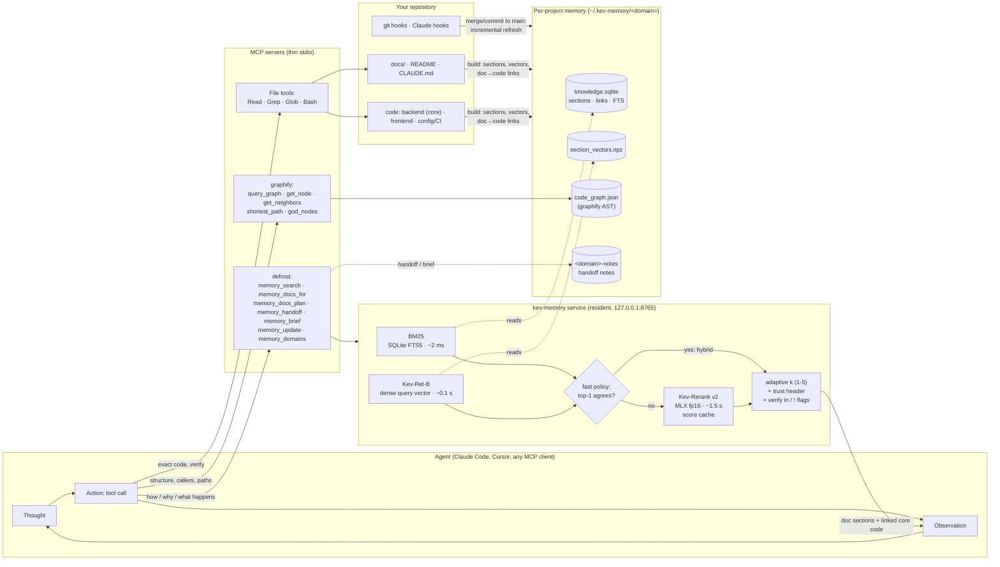
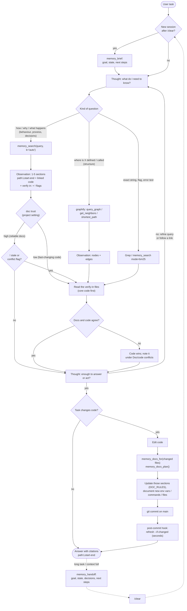

# How an agent should use the memory (ReAct loop)

An agent works in a loop: **think → act (call a tool) → observe → think again**. defrost-ai gives that loop four
kinds of tools. Documentation sections come from the memory: hybrid search, then the reranker. The code graph and
the files hold the truth about the code. Working notes carry state across `/clear`, and doc sync keeps the docs
current. The graph is for navigation; the answer always comes from a doc section, the code, or both.

Rendered copies for slides and the README: [architecture](img/agent_loop-1.svg), [loop](img/agent_loop-2.svg).

## 1. Where the system sits

## 2. The loop, step by step

## 3. Rules the loop follows

| step | rule | why |
|---|---|---|
| choose a tool | Use memory for questions about behaviour, process and decisions; the graph for structure; grep for exact strings | The memory finds the answering doc 94% of the time; graph queries find it 6% of the time ([E2E_GRAPHIFY.md](E2E_GRAPHIFY.md)) |
| `k="auto"` | One confident section is enough, and five means the retriever is unsure | Fewer tokens for the next thought; low confidence prompts a refined query |
| verify | Read the `verify in:` files: always when trust is `low`, and on a `!` flag when trust is `high` | Docs go stale; in the agent test, memory alone repeated a stale CI claim |
| conflicts | Code wins, and the answer lists each doc/code conflict | Silent stale answers are the costliest failure |
| core first | Linked code from the project core (backend, API, db) is shown first | Fewer jumps into UI or test code |
| after edits | `memory_docs_for` the changed files, then update those sections in the same change | Keeps the memory true for the next loop |
| refresh | Git hooks refresh incrementally on main; the agent never rebuilds by hand | The next search already sees the change |
| long tasks | `memory_handoff`, then `/clear`, then `memory_brief` | Carries the goal and state forward, not the full history |

## 4. What each part costs in one loop step (Apple M5, warm service)

| action | typical latency | context it adds |
|---|---|---|
| `memory_search` (hybrid, top-1 agrees) | ~0.1 s | 1–5 sections, about 300 words each |
| `memory_search` (reranked) | 1.2–1.8 s; repeated query 0.04 s | same |
| graphify query | < 0.1 s | node lists (can be large; use for navigation) |
| Read a `verify in:` file | < 0.1 s | the file or a range of it |
| `memory_docs_for` / `memory_docs_plan` | 0.2–0.4 s | list of sections to update |
| `memory_brief` | 0.04 s | ≤ 350 words |
